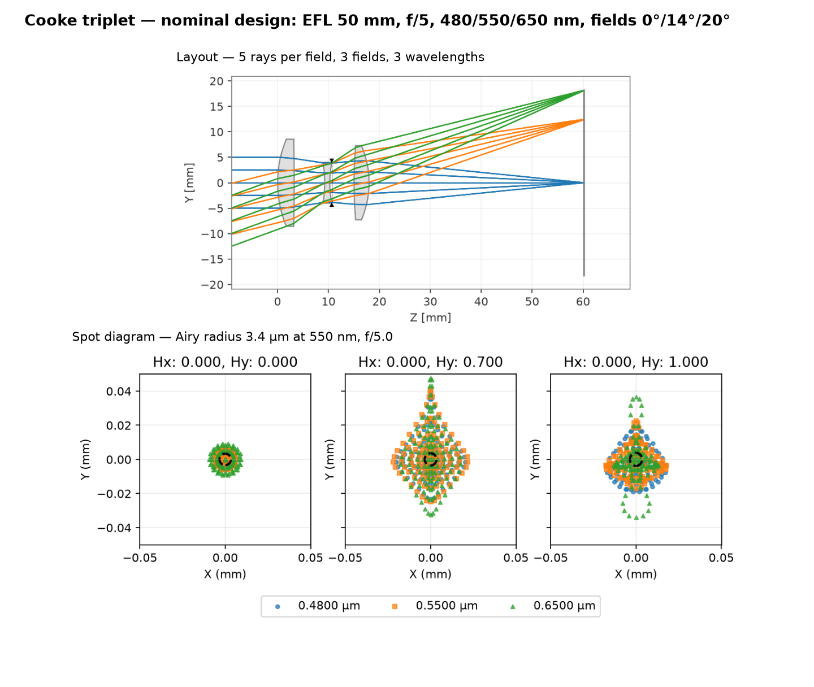

<p align="center">
  
</p>

# optical-design

Understand a lens, improve it against stated requirements, and share the evidence.

An optical-design skill for **Claude Code, Codex, Cursor, OpenCode, and Hermes** that
helps you learn with a bundled example, answer practical optics questions, and analyze
your own lens. Portable prescription work uses Optiland with `.zmx` or Optiland JSON.
Licensed OpticStudio supports `.zos` through the optional native audited adapter.

[](https://github.com/tangericm/optical-design/actions/workflows/ci.yml)
[](https://www.npmjs.com/package/optical-design)
[](LICENSE)

[Get started](docs/quickstart.md) · [Documentation](docs/README.md) · [Releases](https://github.com/tangericm/optical-design/releases) · [Report an issue](https://github.com/tangericm/optical-design/issues)

## Install

**Development preview:** the improvements described here are unreleased; npm and
the `v2.0.0` tag retain the previous behavior. To try this checkout, run
`node bin/optical-design.mjs install --agent codex` from its root (choose your agent).
The npm commands below install the published release. See [compatibility](docs/compatibility.md).

Choose **one** command for your agent, from a terminal in your project:

| Agent | Install |
|---|---|
| Claude Code | `npx optical-design install --agent claude-code` |
| Codex | `npx optical-design install --agent codex` |
| Cursor | `npx optical-design install --agent cursor` |
| OpenCode | `npx optical-design install --agent opencode` |
| Hermes | `npx optical-design install --agent hermes` |

Prefer Claude Code's plugin manager?

```text
/plugin marketplace add tangericm/optical-design
/plugin install optical-design@optical-design
```

Or the shared ecosystem installer, for a wider range of agents:
`npx skills add tangericm/optical-design`.

Needs Node.js 22+, Python 3.11+, and [uv](https://docs.astral.sh/uv/getting-started/installation/);
Optiland is fetched on first use through `uv run --with optiland==0.6.2`. Licensed
OpticStudio is optional. [Installation by client, updates, troubleshooting →](docs/install.md)

## Try it

Start a new conversation and choose a starting point. The agent locates the bundled
files; no prescription is needed for the first example. The new walkthrough currently
requires the development checkout installation described above.

**Learn with an example**

> Use optical-design to walk me through its bundled lens example. Explain how the lens
> forms an image, show the before/after blur, and tell me what the improvement does and
> does not prove. Save the results in a new folder in my project.

**Answer a practical question**

> Will 6.5 µm camera pixels sample my microscope adequately? Use optical-design and help
> me identify the objective NA, magnification and wavelength you need.

**Work on my design**

> Use optical-design to inspect my attached lens. Check import fidelity and units,
> explain what limits it, and suggest the smallest useful change against my requirements.

For a terminal-only guided example:

```sh
node bin/optical-design.mjs walkthrough --out my-first-lens
```

Run this from the development checkout. It creates a candidate lens and a visual review in a new directory. The first run may
download Python and Optiland. [Walkthrough and expected outputs](docs/quickstart.md).

## Example output



The nominal `cooke-triplet` form from the [forms library](skills/optical-design/assets/forms/README.md):
layout with real rays, and the spot diagram at each field against the Airy disk.
[Reproduce this figure](scripts/render-example.py).

## How it works

1. Copy the input file and hash it; never write to the user's path.
2. Inspect it, then run the first-order gate — EFL, F-number, field and conjugates are
   coupled, so a bad spec shows up here before it wastes an optimization.
3. Freeze requirements: fields, wavelengths and weights, metrics with thresholds,
   variables with bounds.
4. Look before optimizing (layout, spot, fans, Seidel table), then optimize
   progressively — first-order operands, then spot, then wavefront or MTF.
5. Look again, re-diagnose, and compare against the diffraction limit.
6. Save, reload, re-measure, tolerance if it will be built, and render a review that separates measured results from acceptance.

Full detail: [SKILL.md](skills/optical-design/SKILL.md).

## What's inside

| Area | What you get |
|---|---|
| Calculators | Resolution, Gaussian beams, OCT and microscopy numbers, no engine needed — `resolve.py` |
| Thin scripts | `inspect_zmx.py`, `first_order.py`, `render_review.py` — deterministic steps around the recipes |
| Optiland recipes | Fourteen tested snippets: layout, spot, fans, Seidel, wavefront/MTF, least-squares and global optimization, glass substitution, tolerancing |
| Primer and references | Aberrations, diagnosis, microscopy, OCT, PSF/MTF, interferometry, merit functions, tolerancing |
| Forms library | Eleven starting designs by F-number, field, and NA, each with commentary |
| Evaluation | Repository-only scenarios, fixed-budget comparison protocol, and regression tests; rubrics are excluded from installations |
| Audited mode | A hash-verified receipt for a bounded, narrower change — for teams that need that discipline |
| OpticStudio | Optional licensed native audited workflow via ZOSPy; Optiland snippets are not interchangeable with ZOSPy |

[Full capabilities table →](docs/capabilities.md)

## Limits

Portable analyses are scalar and centered; audited mode is narrower still (spherical/plane
prescriptions, radius/thickness variables). Optimization finds a local optimum, not a
global one, and nominal performance is not yield. See
[evidence limits](skills/optical-design/references/evidence-limits.md) for the complete,
terse list, and [capabilities](docs/capabilities.md) for what each backend covers.

## Contribute or get help

[Report a bug](https://github.com/tangericm/optical-design/issues/new?template=bug.yml) or
[request a feature](https://github.com/tangericm/optical-design/issues/new?template=feature.yml).
Include your agent, operating system, command, engine version, and error. Use a
synthetic example when reporting a problem with a private prescription.

[Contributing](CONTRIBUTING.md) · [Changelog](CHANGELOG.md) · [Security](SECURITY.md)

## License

[MIT](LICENSE).
