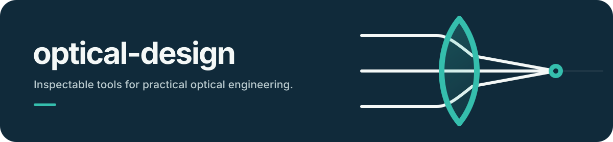
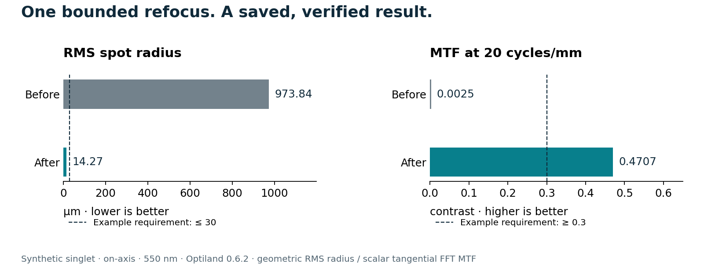

<p align="center">
  
</p>

# optical-design

**From your first lens to an engineering review.**

An optical-design skill and local toolset for **Claude Code, Codex, Cursor, and other
AI agents**. Calculate optical performance, improve supported saved lens models,
and turn results into a review package. Uses Optiland or licensed OpticStudio for
prescription analysis.

[](https://github.com/tangericm/optical-design/actions/workflows/ci.yml)
[](https://www.npmjs.com/package/optical-design)
[](LICENSE)

[Get started](docs/quickstart.md) · [Documentation](docs/README.md) · [Releases](https://github.com/tangericm/optical-design/releases) · [Report an issue](https://github.com/tangericm/optical-design/issues)

## Install

For **Claude Code, Codex, Cursor, OpenCode, or Hermes**, run this in your project
terminal and choose your agent:

```sh
npx optical-design install
```

Or choose explicitly: `npx optical-design install --agent codex`.
Add `--global` to install for all your projects. Requires Node.js 22+.

Prefer **Claude Code's plugin manager**? Run these inside Claude Code:

```text
/plugin marketplace add tangericm/optical-design
/plugin install optical-design@optical-design
```

This installs the skill: instructions, scripts, examples, and references your assistant
can use. Running the scripts needs **Python 3.11+ and [uv](https://docs.astral.sh/uv/getting-started/installation/)**.
Start with the portable example; **OpticStudio is optional**.

[Installation by client, updates, and troubleshooting →](docs/install.md)

## Choose your starting point

**Try the bundled model:** [Run the quickstart](docs/quickstart.md). Run a portable
lens workflow and see the outputs. No OpticStudio license needed.

```sh
npx optical-design doctor
npx optical-design demo --out my-first-lens
```

The demo prints paths to a JSON report and an HTML review, and saves the verified
candidate lens in the output folder. Its first run may download Python and Optiland.

**Use an existing prescription:** [Follow the design workflow](docs/professional-workflow.md).
Inspect the model, set explicit requirements, optimize within bounds, and review the evidence.

## Try it

Start a new conversation in your agent and ask:

> Use optical-design to calculate the Airy first-zero radius and diameter at 550 nm
> and f/4. Run the calculator, show the units, and explain the assumptions.

Then try a complete workflow on the included synthetic lens:

> Use optical-design's bundled portable singlet and refocus specification. Run a
> bounded refocus, check the saved candidate and requirements, and create an HTML
> review. Preserve the source model and put the outputs in a new folder.

Want to run the commands yourself? [Follow the quickstart](docs/quickstart.md).
It takes you from a calculator result to a saved lens and readable report.

## Example output



The portable demo changes only the final air gap, from 60.00 mm to 46.82 mm. Its
on-axis, 550 nm result passes the example requirements and is verified after saving
and reloading. These are computed results for a synthetic model.
[Exact values and settings](docs/examples/refocus-summary.json) · [Reproduce the example](docs/quickstart.md)

## From a model to a decision

**Inspect → Set requirements → Edit or optimize → Validate → Review**

Every design job works on a copy. Reports record settings, engine versions, file hashes,
requirements, and saved-model checks so you can see what changed and why it passed or failed.

| Your task | Start here |
|---|---|
| Calculate resolution, Gaussian beams, PSF/MTF, or aberrations | [Numerical tools and compute tiers](docs/tiers.md) |
| Inspect a prescription or make an explicit edit | [Model inspection and edits](skills/optical-design/references/audited/model-actions.md) |
| Refocus or optimize a saved lens | [Design workflow](skills/optical-design/references/audited/design-workflow.md) and [optimization](skills/optical-design/references/audited/optimization.md) |
| Evaluate sensitivity, tolerances, or extra fields and wavelengths | [Sensitivity](skills/optical-design/references/audited/sensitivity.md), [tolerancing](skills/optical-design/references/tolerancing.md), and [validation](skills/optical-design/references/audited/validation.md) |
| Share results or control jobs interactively | [Review packages](skills/optical-design/references/audited/review-reports.md) and [optional MCP setup](skills/optical-design/references/audited/interactive.md) |

## Current boundaries

The design workflow supports a **bounded subset of centered sequential imaging systems**.
The portable backend handles spherical/plane prescriptions; the native backend also
supports fixed Standard conics and EvenAspheric coefficients. Optimization changes up
to four declared radius/thickness variables. Analyses are scalar.

New-lens synthesis, glass selection during optimization, non-sequential/stray-light
design, and live OpticStudio GUI attachment are outside the shipped scope. A passing
numerical report is evidence for its stated conditions, not manufacturing certification.

[Full capabilities and model limits](docs/capabilities.md) · [Compatibility and verification evidence](docs/compatibility.md)

## How it is distributed

The npm installer copies the skill bundled with its package version. Claude Code and
Codex can use this repository's plugin marketplaces; Cursor can use the direct skill
installer. Native plugin metadata is included for all three clients. Public curated
catalog listings have a separate submission and review process.

The shared ecosystem installer remains available: `npx skills add tangericm/optical-design`.

## Contribute or get help

[Report a bug](https://github.com/tangericm/optical-design/issues/new?template=bug.yml) or
[request a feature](https://github.com/tangericm/optical-design/issues/new?template=feature.yml).
Include your agent, operating system, command, engine version, and error. Use a
synthetic example when reporting a problem with a private prescription.

[Contributing](CONTRIBUTING.md) · [Changelog](CHANGELOG.md) · [Security](SECURITY.md)

## License

[MIT](LICENSE).
