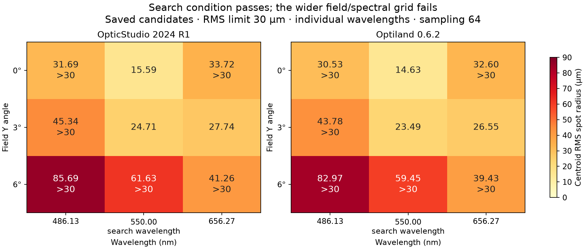

# Field and wavelength validation — 0.1.0-dev.5

Recorded September 13, 2026. This continuation exposed and fixed a native measurement
bug, then demonstrated why an on-axis search pass does not establish field or spectral
acceptance. The shipped example uses three fields and three wavelengths on a synthetic
N-BK7 singlet, with a primary wavelength deliberately located at index 2.

## Native spectral correction

The original adapter requested Standard Spot with **all wavelengths**, then read the
result with different wavelength indices. On OpticStudio 2024 R1 these calls returned
the same combined spot radius for each wavelength at a given field. Consequently, a
multi-wavelength model could have its combined RMS spot mislabeled as a monochromatic
measurement, including when the specification requested only one of its wavelengths.

The adapter now selects the requested field and wavelength explicitly, checks their
readback after analysis, and records the physical field angle, wavelength and monochromatic
mode. The regression oracle removes all other wavelengths from the in-memory model,
then compares each of its three field results with the corresponding original grid cell.
This failed before the fix (84.5188 µm versus a mislabeled 61.3248 µm) and passes afterward.
Nine grid keys and three oracle keys are required, so missing rows cannot silently pass.

The earlier single-wavelength singlet examples do not have this spectral ambiguity.
Previous multi-wavelength native RMS spot results from the prescription adapter should
be rerun with this correction. This change does not alter the separate Huygens/POP
profile backend or resolve its existing approximately 22% real OCT discrepancy.

## Fixed experiment

The native and portable fixtures have matching prescriptions: 10 mm entrance pupil,
+50/-50 mm radii, 5 mm N-BK7 thickness and an initial 60 mm image gap. Fields are Y angles
0°, 3° and 6°. Wavelengths are 0.4861327, 0.55 and 0.6562725 µm, with 0.55 µm primary.
Each run searches radius 1 and thickness 2 within the existing bounds, using field 1,
wavelength 2 and sampling 64. Every run uses 81 evaluations including two final validation
calls. Those validation calls contain multiple per-condition optical analyses.

The control repeats the search condition. Expanded validation keeps the 30 µm RMS limit
and 0.3 tangential MTF limit at 20 cyc/mm, applies them over all nine pairs, and also
requires sagittal MTF ≥0.3 at every pair. Focal-length and track limits stay unchanged.
Specifications were defined before evaluation, and the limits were not tuned after failures.

| Engine / interface | Control | Expanded validation | On-axis 550 nm RMS | 6° / 486.1327 nm RMS | Failed expanded requirements |
|---|---|---|---:|---:|---:|
| OpticStudio native CLI, corrected | Accepted | Rejected | 15.5877 µm | 85.6876 µm | 13 of 29 |
| Optiland, official MCP client | Accepted | Rejected | 14.6279 µm | 82.9717 µm | 14 of 29 |

Both pairs select exactly the same candidate within their engine: native
`[51.46240234375, 47.5042724609375]` mm and portable
`[51.39892578125, 47.50341796875]` mm. The validation results never feed back into that
search. Full measurements are present for all nine pairs and both MTF axes; rejection
comes from finite measurements exceeding requirements, not missing data. Native and
portable source files remain unchanged, and baseline restoration and saved model hashes
are verified. Both expanded results expose no accepted candidate and retain a hashed
`rejected-candidate-model` artifact.



The figure shows the RMS requirement only; the full report also assesses both MTF axes.
It is a comparison of two bounded numerical demonstrations, not an equality test between
engines or evidence of physical performance. Pupil constructions differ. Individual
monochromatic results are not polychromatic MTF, and sampling 64 alone proves no convergence.

## Valid evidence and diagnostic history

- **Valid native evidence:** `corrected-native/`, including the two reports, source/model
  snapshots, specifications, stdout and stderr. `corrected-native/zos-runs.json` records
  argv, output paths and observed exit codes 0/1.
- **Valid portable evidence:** `optiland-runs.json` contains actual official MCP requests
  and responses. `mcp/` contains owned input snapshots, reports and process logs. Control
  and expanded runs both finish as completed jobs, with optical acceptance true/false.
- `predeclared-inputs.json` binds the shipped model/spec bytes. `verified-evidence.json`
  binds the final results and current implementation hashes. `verify_evidence.py` checks
  source identity against the manifest, search identity, input/output hashes, assessments,
  physical conditions, complete coverage, fixed winners and rejected artifact handling.
- `rms-grid.png`, `rms-grid.svg` and `rms-grid.csv` derive from verified results;
  `render_grid.py` reproduces them without launching an optical engine.
- **Invalid pre-fix diagnostic runs:** top-level `native-control/`, `native-validation/`,
  `zos-runs.json` and `pre-fix-summary-invalid.json` retain the original combined-wavelength
  defect. They are excluded from the final verifier and must not support optical acceptance.
  `spot-selection-probe.json` records the direct API diagnostic.
- **Fixture setup diagnostic:** `setup-diagnostic/` retains an initial native fixture
  with the wrong primary wavelength. Assigning an unsupported `PrimaryWavelength` attribute
  did not change native state. The builder now calls `MakePrimary()` and checks the
  primary wavelength, physical values and fields after saved-model reload. This correction
  preceded all native optimization runs. Portable inputs were byte-identical across it.
- `wavelength-red.log` / `wavelength-green.log` retain the failing/passing spectral oracle.
  `pytest-before-spectral-fix.log` is historical and does not validate the corrected code.
  `pytest-final.log` is the full final run. Generated native caches and licensing scratch
  are excluded from Git and the package.

## Reproduce and extend

The installed skill includes [the executable example](../../../skills/optical-design/references/field-validation-example.md)
and both fixture formats under `assets/field-validation/`. Use a fresh output directory
for each CLI run. The research driver `exercise.py --backend zos` or `--backend optiland`
requires the corresponding pinned environment and refuses to overwrite its result record.
For new research runs, copy the driver and manifest to a fresh sibling research folder;
the native driver writes a `corrected-native/` subdirectory. Absolute paths in retained
receipts identify the original worktree, and the verifier remaps them to its current checkout.

```powershell
uv run python docs/research/field-validation/verify_evidence.py
```

The native fixture builder uses a new asset directory and refuses to overwrite an existing
one. Its retained script documents construction; rerun it in a fresh development copy
when replacing the example deliberately. The MCP driver passes the trusted host environment
to its local server but does not serialize environment values.

## Review and sources

Final verification: **614 Python tests passed**, with one Windows symbolic-link capability
skip, using `OPTICAL_DESIGN_LIVE=1` and the pinned optional dependencies. Seven package
tests, Ruff, skill lint, package install verification and diff whitespace checks pass.
The new tests cover the full requirement grid, reordered subsets on both engines, native
physical selection metadata and the single-wavelength oracle.

Independent review strengthened the reordered field/wavelength test, required exact
oracle coverage, and bound the evidence verifier to the predeclared model/search inputs.
No additional actionable finding remained in the native correction. Package installation
verification also caught native `.ZDA` cache inclusion; explicit exclusions now prevent
those generated files from shipping.

The installed API reflection confirmed `GetRMSSpotSizeFor(fieldN, waveN)`; the problem
was the analysis selection, not swapped parameters. The direct probe and single-wavelength
oracle establish behavior on the tested API version. The vendor
[spot-data interface](https://developer.ansys.com/docs/zos-api-interface-2024-r2/interface_z_o_s_a_p_i_1_1_analysis_1_1_data_1_1_i_a_r___spot_data_result_matrix.xhtml)
documents the method. Ansys's
[sequential analysis guide](https://optics.ansys.com/hc/en-us/articles/42661713256723-Exploring-Sequential-Mode-in-OpticStudio)
and Optiland's
[analysis framework](https://optiland.readthedocs.io/en/latest/developers_guide/analysis_framework.html)
provide context for field/wavelength analysis. Web documentation checked September 13,
2026; native execution used OpticStudio 2024 R1 / API 24.1.0 / Premium, ZOSPy 2.1.5 and
pythonnet 3.1.0. Portable execution used Optiland 0.6.2 and MCP 2.2.0 on Python 3.11.15.
