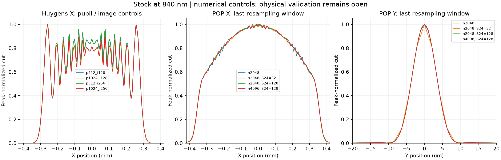

# Stock OCT: controlled 840 nm sampling experiment

The tested numerical controls do not explain the approximately 22% Huygens–POP
difference in the Stock model's X full 1/e² intensity width. This is a narrower
conclusion than declaring either method correct or the model physically validated.
All experiments used copied prescriptions; the source and collimator were unchanged.

## Experiment and evidence

Five new native cases complement the retained 75-case reference benchmark: the missing
Huygens 512-pupil/128-image/6 µm baseline, a 1024-pupil/256-image/3 µm case, and POP
last-resampling-window controls at S24. Field 1, active wavelength 9 (0.840 µm), native
polarization, the original prescription, and the prescribed source remain fixed.
Huygens uses the planar reference and central X cut. POP uses the same explicit
Gaussian-waist launch, 1 W input, start S1/end S28, and separate X/Y propagation.

The manifest is [manifest.json](manifest.json); the native receipt and five hashed raw
records are in [live/report.json](live/report.json). The new run is reference-free and
correctly reports `completed`, `reference_validated: false`. The prior run supplies
the matching controls. [reduce_controls.py](reduce_controls.py) recomputes the summary
from retained raw arrays; [controlled-summary.json](controlled-summary.json) preserves
settings, native grids, metrics and comparisons. Widths use outermost, linearly
interpolated sampled-peak intensity crossings. No profile extrapolation is used.

## Results

| Controlled change | X full 1/e² width change | Native output pitch consequence |
|---|---:|---|
| Huygens pupil 512 → 1024, image 128, 6 µm spacing | +0.1151% | Image pitch unchanged |
| Huygens image 128/6 µm → 256/3 µm, pupil 512 | −0.1796% | X pitch halved; support remains ±0.384 mm |
| Same image refinement, pupil 1024 | −0.1549% | X pitch halved; support remains ±0.384 mm |
| POP 2048 → 4096, same 0.8 mm launch and 64 mm S24 window | +0.1972% | X pitch halved; Y pitch essentially unchanged |
| POP S24 window 64 → 128 mm, sampling 2048 | +0.4338% | X pitch doubles; Y pitch approximately halves |
| POP S24 window 64 → 32 mm, sampling 2048 | −0.0215% | X pitch approximately halves; Y pitch doubles |
| POP 2048 → 4096, S24 window 128 mm | −0.3185% | X pitch halved; Y pitch essentially unchanged |

Across these retained 840 nm cases, Huygens X width is 0.606201–0.607991 mm;
POP is 0.740764–0.744137 mm. The finer Huygens case is 0.607049 mm; POP at
4096 and S24=128 mm is 0.741767 mm, about 22.2% larger. Small width changes do
not prove the full profile is stable: Huygens central ripple amplitude still changes
with pupil sampling, as visible in the plot.

The original increase from POP 2048 to 4096 did not refine Y resolution. Changing
S24 from 64 to 128 mm does: its Y output pitch changes from about 1.054 µm to
0.527 µm. It simultaneously coarsens X, so this is a coupled window/sampling test.
At 4096 with the wider S24 window, Y full 1/e² width is 12.4117 µm, compared with
12.4484 µm for the original 2048 case. These are central intensity cuts, not
point-image PSFs, integrated marginals, or measured OCT resolution.

## Interpretation and remaining physical evidence

Ansys describes Huygens as an image-space coherent sum of ray-derived amplitudes
and phases, requiring adequate pupil sampling. That supports varying the pupil
and image grid independently rather than treating their counts as one convergence
parameter. [Ansys Huygens documentation](https://optics.ansys.com/hc/en-us/articles/42661795535251-What-is-the-difference-between-the-FFT-and-Huygens-PSF).

POP sampling and guard bands can create downstream artifacts; a useful check must
inspect the physical beam grid, not only its array size. The demonstrated pitch
readbacks explain why the original Y sampling-count comparison was insufficient.
The present experiment does not independently vary output pitch and guard band,
or inspect every intermediate phase/intensity plane. [Ansys POP sampling guidance](https://optics.ansys.com/hc/en-us/articles/42661979347731-Using-Physical-Optics-Propagation-POP-Part-2-Inspecting-the-beam-intensities).

Ansys also distinguishes single-step diffraction analyses from propagating a sampled
wavefront through the system; intermediate foci, truncation and extended propagation
can matter. This is a plausible explanation to investigate, not a diagnosis proven
by this experiment. [Ansys POP model description](https://ansyshelp.ansys.com/public/Views/Secured/Zemax/v251/en/OpticStudio_User_Guide/OpticStudio_Help/topics/About_Physical_Optics_Propagation.html).

Measured fiber/source calibration, the actual cube/coating polarization and phase
behavior, and matching bench measurements remain absent. The earlier reference
audit records the difference between the vendor test bench and the full sample
arm. No fitting of source parameters to force agreement was performed. Manufacturing
yield, collection-arm performance and OCT SNR are not established here. The new
optimizer is verified separately on supported synthetic spherical prescriptions.
