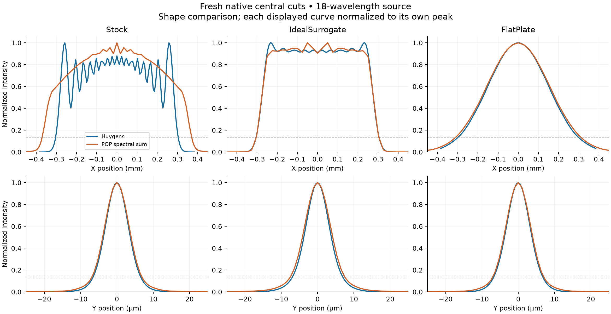

# Real-design benchmark: verified development milestone

September 12, 2026. Optical-design **0.1.0-dev.2**, implementation commit `e2a0be5`.

The skill now reproduces the current line-field OCT models through a separate, read-only
native Huygens/POP workflow. **All 75 native cases pass their declared reference comparisons**:
three models, 25 cases per model, 135 retained intensity profiles. Two additional native
smoke cases pass using the final CLI and reload/failure guards. Original models, copied
prescriptions, native catalog/coating files and raw result hashes were rechecked successfully.
This establishes numerical reproduction, **not physical acceptance of the optical design**.

## What changed

- Added a strict manifest, complete model/case/axis reference coverage, explicit tolerances,
  copied-model ownership, native settings readback and restoration checks.
- Added Huygens central cuts and polarized Gaussian-waist POP with a declared propagation
  and resampling schedule. The original spherical optimization adapter remains restricted;
  its [copied Stock probe](probe/restricted-adapter.json) correctly rejects the source-NA model.
- Added outermost interpolated intensity widths, disconnected-region diagnostics, fixed-ROI
  CV and absolute spectral sums. Missing coverage, undersampling and incompatible cut positions
  remain visible. Interpolation does not create native spatial resolution.
- Hardened failure receipts, Windows filename identity, loaded-file identity, raw artifact
  preservation and native process shutdown. Benchmark acceptance cannot survive a failed
  native shutdown merely because a report was already written.

The installable package includes the [workflow guide](../../../skills/optical-design/references/profile-benchmark.md)
and reusable code. Real prescriptions and this research evidence are excluded from package
distribution. Disposable real-model copies are also excluded from Git history.

## Verification evidence

| Check | Result |
| --- | --- |
| Full native run | 75/75 cases, 135 profiles; OpticStudio 2024 R1/API 24.1.0, Premium |
| Final CLI native smoke | 2/2 cases, 3 profiles; ZOSPy 2.1.5, pythonnet 3.1.0 |
| Final offline receipt/array check | Both native receipts verified with final comparison code; no additional optical calculation |
| Huygens intensity differences | Maximum absolute difference 0.0 in relative intensity |
| POP cut intensity differences | Maximum absolute difference 8.881784197001252e-16 W/mm² |
| Coordinates | Maximum absolute difference 0.0 mm |
| Integrated POP power | Maximum absolute difference 1.525657378209644e-11 W |
| Python regression suite | 451 passed, 34 optional-engine tests skipped |
| Package tests | 7 passed; Ruff, skill lint and pack/install verification passed |
| External OCT source/geometry tests | 6 passed; original project remains clean |
| Scientific/code review | Readback, units, missing ROI, position mismatch, filename aliases and preservation regressions tested |

Intensity and power comparison uses `rtol=1e-6`, `atol=1e-8`; coordinates use absolute
`1e-10` mm tolerance and no interpolation. These are repeatability tolerances for the
stored numbers, not claims of corresponding physical accuracy. Exact scalar-width agreement
alone would not satisfy this benchmark.

Receipts: [native report](live/report.json), [final smoke](smoke/report.json),
[final verification and validator hashes](final-verification.json), [derived metrics](derived-summary.json).
All [24 fresh full-spectrum widths](derived-width-check.json) also reproduce the saved
summary exactly, after restricting spectral reduction to common native support.
The 75-case run began before the last failure-handling hardening. The final two-case native
smoke exercises that final implementation; the offline recheck verifies all 75 retained cases
with the final comparison code and rechecks the input/dependency/artifact hashes. Raw production
receipts remain unchanged. This offline recheck is not counted as another native run.

## What the real design shows

Fresh full-spectrum X full 1/e² widths:

| Model | Huygens, mm | POP, mm | POP difference relative to Huygens |
| --- | --- | --- | --- |
| Stock | 0.607805 | 0.741482 | +21.9934% |
| IdealSurrogate | 0.609604 | 0.607493 | -0.3464% |
| FlatPlate | 0.596172 | 0.619401 | +3.8962% |



Each plotted curve is normalized to its own peak for display. POP spectral combination
uses absolute irradiances and normalized active source weights before that display scaling.
The dashed line is exp(-2). X and Y use different position units, clearly marked.

Stock's Huygens X profile has three disconnected regions above half maximum. Its reported
FWHM is the outermost span, not a single smooth lobe width. Its narrow Huygens Y window cannot
cover the 0.42 mm flatness ROI, so Y flatness is unavailable. The final spectral reducer also
removes the old reporting grid's out-of-support Y tails for Stock and FlatPlate instead of
zero-padding them; all threshold crossings remain inside the retained common support.

The 2048→4096 POP pair roughly halves final X pitch, but final Y pitch stays near 1.054 µm
(ratios about 1.000027). It therefore does not establish convergence under finer Y sampling.
The saved Huygens X controls change pupil and image sampling together; they are not an
isolated convergence sweep. Dense spectral interpolation cannot repair either limitation.

## Next engineering gate

Resolve the Stock method/launch/sampling discrepancy through controlled pupil, image-grid,
physical-pitch and window checks, then compare a matched measurement. Preserve fixed source
surfaces 0–3. Do not transplant the simpler Ayase bench measurements into full-sample hard
requirements or optimize toward whichever method happens to look better.

The [interpretation and prioritized experiments](interpretation.md) distinguish hypotheses
from findings and cite primary Ansys guidance on propagation, apodization and sampling.
The [reference audit](reference-audit.md) records exact model identities, active spectrum,
measurement limits and the provisional cube. This milestone supplies the reproducible
baseline needed for an optical-design agent; broader optimization and compensated tolerancing
remain subsequent work.

## Reproduce locally

```powershell
uv run skills/optical-design/scripts/benchmark.py --manifest docs/research/real-benchmark/manifest.json --out NEW_EMPTY_DIRECTORY --json
uv run python docs/research/real-benchmark/verify_evidence.py
uv run --no-project --with numpy --with matplotlib python docs/research/real-benchmark/reduce_benchmark.py
```

The manifest points to external user models. The latter two commands recheck/reduce the
retained `live` and `smoke` directories; they do not open OpticStudio or rerun the optical model.
